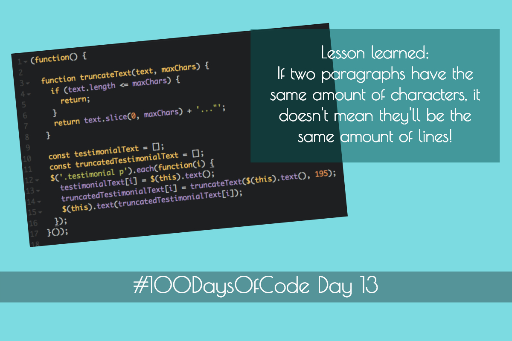
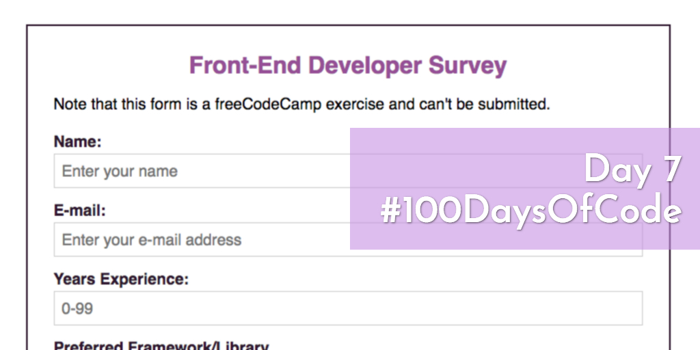
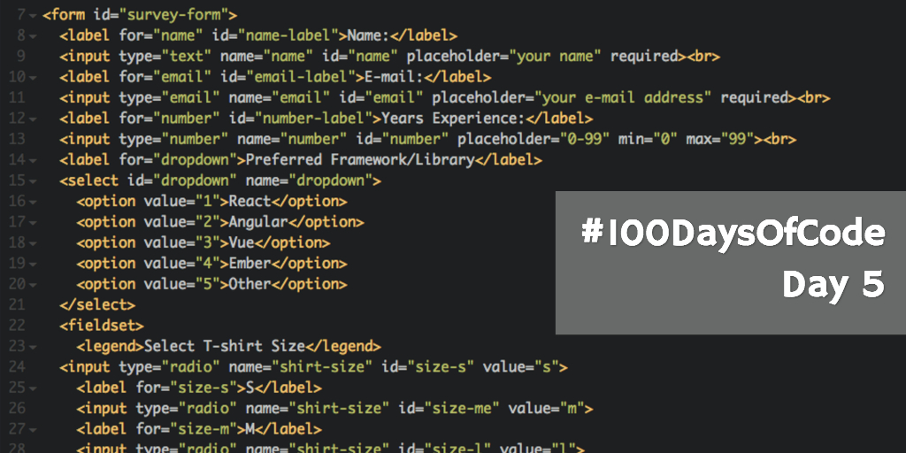
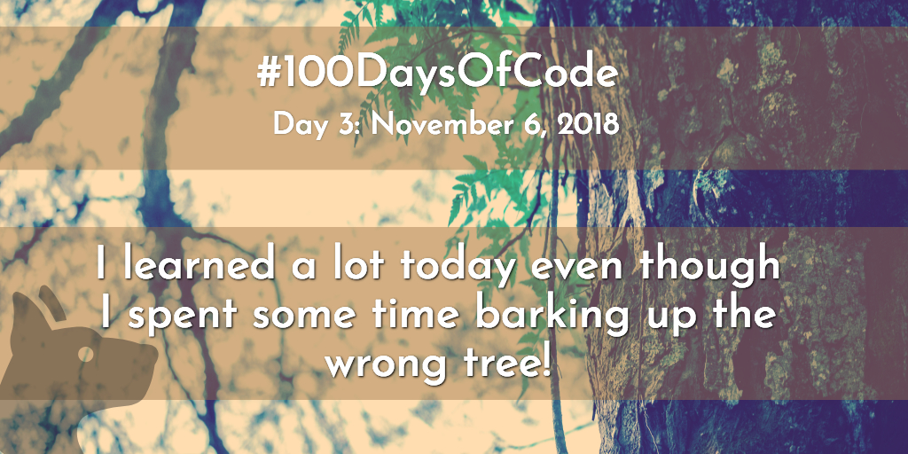

# 100 Days of Code: Round 1


This is my log for the [100 Days of Code](https://www.100daysofcode.com/) challenge that I started on 11/4/18.

Day 56: January 12, 2019

**My Website:** I changed the Typography theme and updated style for fonts and other things.

**JS Course:** I completed up through Section 6 Lecture 79, and am getting a better understanding of the module pattern.

**Algorithms Course:** I tried solving the algorithm challenge to find the longest substring without repeating characters which is also a [medium LeetCode problem](https://leetcode.com/problems/longest-substring-without-repeating-characters/). I made some progress and will continue tomorrow. 

**Links:**
* [GitHub repo for kelliblalock.com](https://github.com/kellim/kelliblalock-dot-com) 

## Day 55: January 11, 2019

**PROGRESS:**

**My Website:** I installed `react-icons` and added social icons. 

**JS Course:** I made it to section 6, lecture 75 and am excited to start the Budget App project. 

## Day 54: January 10, 2019

**PROGRESS:**

**Algorithms Course:** I spent 2 1/2 hours on the `minSubArrayLen` challenge, which is also [a medium on LeetCode](https://leetcode.com/problems/minimum-size-subarray-sum/). I know that is a long time to solve an algorithm, but I'm happy that I didn't feel totally clueless and steadily made progress. 


## Day 53: January 9, 2019

**PROGRESS:**

**JS Course:** I completed Section 5 Lecture 70 - coding challenge #7 which is a multiple choice console quiz game that stores questions in an object and receives input using `prompt()`. I also completed the optional "Expert" add ons to the game which includes keeping score. 

## Day 52: January 8, 2019

Missed coding on January 7th so today is day 52 instead.

**PROGRESS:**

**JS Course:** I completed Section 5 Lecture 69 - Bind, Call and Apply. 

**Algorithms Course:** I spent some time on the "minSubArrayLen" challenge. It's one that can be solved with the sliding window pattern, but I haven't figured it out yet. I want to spend more time on it before I look at the solution code.


## Day 51: January 6, 2019

**My Website:** I worked on the "About Me" text for my site for a couple hours, but I'm not really satisfied with it.

**JS Course:** I finished up through section 5 lecture 68 on closures. It was one of the best explanations of closures I've seen. 

**Algorithms Course:** I worked on the "maxSubarraySum" problem. It's one of the challenges but it was also an example in the course for the sliding window pattern. I didn't remember how to solve it and had to watch the video about the sliding window pattern again before I could do it. 

## Day 50: January 5, 2019

I'm at the half way point - day 50 of 100 days of code! 

**PROGRESS:**

**My Website:** I added the project images I updated to the repo as well as updated project descriptions and style. 

**Algorithms Course:** I completed the algorithm challenge "isSubsequence" where you write a function that takes two strings as arguments and you must figure out if the characters in the first string form a subsequence of characters in the second string. In other words, the characters in the first string have to all be present in the correct order in the second string, but they don't have to be all together. For instance, 'bay' forms a subsequence of characters in 'binary' since 'b', 'a', and 'y' are all in 'binary' in the correct order.

My solution is using `i` for the first string and `j` for the second string to act as pointers to characters in the strings with both being initialized to 0. It loops through each character in the second string and checks if the value at index `j` in the second string is equal to the value at index `i` in the first string. If they are equal then `i` is incremented which means that character you just checked in the first string is in the correct order for a potential subsequence and you want to move on to the next character, but if it's not then you leave it. It then checks if `i` is equal to (or greater than) the length of the first string, and returns true if it is because that means you've gone through every character in the first string and have determined that each character in it is present in the second string in the correct order. If the loop never returns true, then false is returned after exiting the loop because it would have already returned true if there was a valid subsequence.

Here's the code I wrote:

```
function isSubsequence(s1, s2) {
  let i = 0;
  for (let j= 0; j < s2.length; j++) {
    if (s1[i] === s2[j]) {
      i++;
      if (i >= s1.length) return true;
    }
  }
  return false;
}
```

**Links:**
[GitHub repo for kelliblalock.com](https://github.com/kellim/kelliblalock-dot-com)

## Day 49: January 4, 2019

**PROGRESS:**

**Algorithms Course:** Worked on the "AveragePair" algorithm challenge where you're given a sorted array of integers and a target average, then you have to find out if there's a pair in the array where their average is equal to the target average. I spent a long time thinking this one through. In the end, I looked at the answer after I thought I couldn't figure it out, but it turns out I had the right idea about solving it, I just wasn't confident in the answer.

## Day 48: January 3, 2019

**PROGRESS:**

**My Website:** I worked on creating better images instead of coding today.

**JS Course:** I'm currently in the middle of Section 5 Lecture 65. I liked reviewing objects and I created my own Dog function constructor along with several dog objects that could bark.

**Algorithms Course**: I solved the "areThereDuplicates" challenge where you're given a variable number of arguments and you check to see if any of the arguments passed in are duplicates of one another. Here's my code:
```
 function areThereDuplicates() {
    const args = [...arguments];
    const counter = {};
    for (let arg of args) {
        if (counter.hasOwnProperty(arg)) {
            return true;
        } else {
            counter[arg] = 1;
        }
    }
    return false;
 }
```

It starts off creating an array containing all the arguments passed in and a counter object that will hold the arguments as we loop through them. It basically loops through the arguments and if the argument isn't already present in the counter object, it will add it with a frequency of 1, but if it is already present, then it will return true, meaning that there's a duplicate. If you're able to get through the entire loop without returning true, there are no duplicates and it will return false. The time complexity is O(n) since there's just one loop.

The instructor provided 2 different answers and mine is a little different, but I think it's OK! I also tested edge cases like having no arguments or only one argument and it worked as expected.

***Links***

* [GitHub repo for kelliblalock.com](https://github.com/kellim/kelliblalock-dot-com) (Didn't update today after working with the images.)

## Day 47: January 2, 2019

**PROGRESS:**

**My Website:** I added missing project images and updated the project list style, but it still needs work. I need to retake screenshots for all the projects and make them bigger. 

**JS Course:** Completed up to Section 5 lecture 60. This section is about objects and functions and I'm really excited to review objects as he explains how things work under the hood pretty well. This course goes over the old (pre-ES6) syntax for everything up until Section 7 and some people don't like that, but I think it's good to know pre-ES6 JavaScript because there's still lots of code around that doesn't use ES6. 

**Algorithms Course:** Watched the lecture that introduces the Divide and Conquer pattern (there will be more on that later) and then advanced to section 6, the optional challenges. I completed the first challenge in the section, "Frequency Counter - sameFrequency" and passed. I'm still a bit slow at solving algorithms, but I'm getting better and faster with practice. 

***Links***

* [GitHub repo for kelliblalock.com](https://github.com/kellim/kelliblalock-dot-com)

## Day 46: January 1, 2019

I was out most of the day, but got the minimum of coding time in.

**PROGRESS:**

**JS Course:** Completed the coding challenges to add features on my own to the Pig game tutorial code. It was fun, but I'm hoping for harder challenges that I feel are impossible to solve at first, because that's how you learn things in programming - solving the seemingly unsolvable. If something isn't hard at first, you're not stretching your coding skills and learning. I don't remember where I got that idea from, but it's so true, and when something is difficult I just remember that it's supposed to be that way if it's to be a learning experience.

## Day 45: December 31, 2018
***Progress***

**My website:**  I got started on a `Main` component to hold my name, title and social icons as well as a `SocialIcons` component. I'm also rethinking the design. 

**Jonas Schmedtmann JS course:** Made it to the end of video 53 and finished the Pig tutorial game. Next up is a coding challenge to add features to the game on my own.

**Colt Steele Algorithms course:** Made it to the end of video 33 and learned about the sliding window pattern. I completed the Maximum Subarray Sum problem from scratch after seeing the instructor's solution. It feels like a win to write working code for an algorithm even if I just saw the answer. I'm looking forward to the next section where there are some algorithm challenges that use this pattern. But first, there's a lesson on the Divide and Conquer pattern.

***Links***
 
* [GitHub repo for kelliblalock.com](https://github.com/kellim/kelliblalock-dot-com)

## Day 44: December 30, 2018

**PROGRESS:**

I figured out the why images were too big and not keeping their aspect ratio in Gatsby when using `gatsby-image` by looking at the image that was already in my new Gatsby site that uses the default starter code and seeing what was different. I just need to put a `div` that sets `maxWidth` around the images on my site using `gatsby-image` (working on that). Just setting `maxWidth` in the query wasn't working and trying to style the divs Gatsby puts around images didn't work either. 

It's too bad Flexbox isn't working with `gatsby-image` for me, but CSS Grid works so far--at least the images are still visible when you use `display: grid`. I'm not as comfortable with Grid as I am with Flexbox, but it's time I learn it better!

I am now on video 49 of Jonas Schmedtmann's JS course. The DOM section and is mostly review but I'm excited about the tutorial to make a dice game called Pig. This makes me want to create a Farkle game on my own!

I managed to get some algorithm study time in, and completed the Count Unique Values challenge. I was so happy that I could solve the algorithm on my own before he talked about how he'd go about solving it and giving the answer. I like his answer better as it's really clever, but the runtime for mine is the same at O(n).

***Links***

* [GitHub repo for kelliblalock.com](https://github.com/kellim/kelliblalock-dot-com)

## Day 43: December 29, 2018

I tried to resolve the problem with images on my site stretching and losing their aspect ratio when using `gatsby-image`. I researched, read documentation, and tried different styles. At the end of the day, I created a new Gatsby site with the default starter code to see if I could recreate the issue there, which I'll play around with tomorrow. Also, another issue is when I use Flexbox to position images using `gatsby-image`, the images disappear.

I progressed to video 40 in Jonas Schmedtmann's JS course - I'm on the section on how JS works under the hood. I knew most of this but it was a good review and he's good at explaining it.

I also completed the Anagram challenge for Colt Steele's JavaScript Algorithms course. I loved it, algorithms have never made so much sense!

**Links**
* [GitHub repo for kelliblalock.com](https://github.com/kellim/kelliblalock-dot-com) (Didn't push changes - the code was basically back to what it started as at the end of the day.)

## Day 42: December 28, 2018

I worked on my website a little and figured out why the page wasn't centered, however that brought up another issue where the images are bigger than the maxWidth specified when using gatsby-image and I am researching that.

I also made it to video # 27 in  Jonas Schmedtmann's JavaScript course. Since I already know JS, I've been watching at double speed before I get to the part I'm interested in about creating vanilla JS apps using MVC. Udacity's JS Design Patterns course touched on MVC in JS without a framework, but I want to go more in depth and improve my code organization skills.  I also decided not to skip stuff because Jonas is a good teacher and I learn some tips along the way.

I also got back into Colt Steele's JavaScript Algorithms course and reviewed my previous notes, then made it to the problem solving patterns section and learned about the frequency solving pattern which isn't totally new to me but the example was great and I feel more comfortable solving the types of problems where you use objects to keep count of things.

**Links**
* [GitHub repo for kelliblalock.com](https://github.com/kellim/kelliblalock-dot-com)

## Day 41: December 27, 2018

Today I worked on my website. The page is working but the style for centering the page isn't working and I tried figuring that out to no avail yet. I also recreated the GitHub repository for the site since I had started one before that wasn't using Gatsby. 

Other than that, I read some web development articles on [Tania Rascia's blog](https://www.taniarascia.com/blog/) which I came across today. I found [Design for Developers: Specific Steps to Improve Your Website Design](https://www.taniarascia.com/design-for-developers/) especially interesting and hope to implement the tips there so my website looks good since I'm not a designer.

**Links**
* [GitHub repo for kelliblalock.com](https://github.com/kellim/kelliblalock-dot-com)

## Holiday Break

I'm taking a break from 100 Days of Code until after Christmas, then I'll resume with day 41.

## Day 40: December 18, 2018

I'm still working on my Gatsby site and learning as I go. There are often many things to research each day, like today I realized there was a problem with the way I was using CSS modules since I'd styled an image to be round in one component, but that made all images round. The page isn't displaying at the moment, but it's late and I'll troubleshoot it tomorrow. 

## Day 39: December 17, 2018

I continued to work on my Gatsby site and got images to work in the Project component. Before I was only displaying the same image for all the projects. I also started an About component.

## Day 38: December 16, 2018

Today I worked on my Gatsby site and refactored the way images were passed down to the Project component.

## Day 37: December 15, 2018

I wanted to add some style and looked at the different options, then decided on using CSS modules with SCSS over inline styles or styled components. I like having separate SCSS files and each component will be in its own directory that also contains the SCSS for the component. I did get the CSS modules setup and working with SCSS, but I didn't add much style yet other than to test that it works. 

I've done more research and planning than coding so far, but that's okay. Hopefully tomorrow I can knock out some code!

## Day 36: December 14, 2018

I worked on passing data as props to the Project component and researched where I should put the data. I decided to put a `.json` file in `src\data` that contains the information for each project. 

## Day 35: December 13, 2018

I got multiple images (2 so far) to display on my index page using `gatsby-image` and you can tell they're lazy loading, but it seems like they should load right away and not show them blurred. For the project image, I started a Project component that will display a project with its picture and some info.

Also, today I was getting a bunch of console errors when viewing my site on localhost and spent some time troubleshooting why the page wasn't displaying. It turns out the issue was that I had named an image file with an extra `.jpg` in the file extension, for instance `image.jpg.jpg`. I'm on a new Windows 10 install and had forgotten to change settings in File Explorer so file extensions are always shown and so they were showing up like `image.jpg` there but the extra `.jpg` was hidden.  

## Day 34: December 12, 2018

I researched Gatsby images and watched a tutorial on how to display images in Gatsby but it doesn't use `gatsby-image`. The example in the starter code is just for one image, but I need to display multiple images.

## Day 33: December 11, 2018

I read some Gatsby articles as my main coding activity for the day, but didn't get to coding my website yet.

## Day 32: December 10, 2018

I had issues creating a new Gatsby project for my website, but got it to work on my Windows 10 PC after it didn't work on the Mac. I still need to troubleshoot the Mac issue. But, do I really? Perhaps Windows + Linux will be the best way to code going forward. Anyway, I now have a local repository for my website with barebones Gatsby starter code that I'll need to turn into a portfolio and blog. Yay!

## Day 31: December 9, 2018

I kept practicing with my Gatsby test site and planned out the components to create for my site. 

## Day 30: December 8, 2018

I watched the [Gatsby JS Crash Course](https://www.youtube.com/watch?v=6YhqQ2ZW1sc) and then made my own Gatsby test site to reinforce what I've learned. I also read up to page 33 in Hello Web Design including the chapter on color. Choosing colors for my own projects is harder than coding.

## Day 29: December 7, 2018

I finished the official Gatsby tutorial and also read Gatsby documentation and did some research into what the best way is to create a Gatsby blog and I'm not sure which way to go yet but I'm leaning torward writing my posts in markdown over using Wordpress as a backend because I think it would be more secure.

## Day 28: December 6, 2018 

I made it to the end of section 4 "Data in Gatsby" in the official Gatsby tutorial and in it was a link to [How to GraphQL](https://www.howtographql.com/) where I completed GraphQL fundamentals. GraphQL sounds better and more efficient than REST and I can't wait to use it in Gatsby and other projects!

## Day 27: December 5, 2018 

I continued with the official Gatsby tutorial and I have been taking my time reading other Gatsby documentation pages, some of which were linked to from the tutorial. There are 8 sections and I'm only on the second one, but I hope I can pick up the pace to finish it soon.

## Day 26: December 4, 2018

I started the official Gatsby tutorial today and I also changed my mind that each day I need to do 1 hour of coding outside of tutorials for it to count for 100 days of code. If I'm doing a tutorial that I need to complete for a project, I think that's OK rather than trying to find something else to code. However, I'll try to add to the tutorial code where I can.

I didn't do any coding yesterday because I was busy fixing my PC. I'm following the rule that it's OK as long as I don't miss 2 days in a row, but I still should have coded because it's not my only computer. I'll try my best not to miss any more days, but the holidays might be a little challenging.

## Day 25: December 2, 2018

It's been a busy weekend and I missed yesterday. Today I tested Gatsby out in a repl to see what I could figure out before doing the Gatsby tutorial.

What did I learn? See my [Testing Out Gatsby repl](https://repl.it/@kellim/testing-out-gatsby) for details!

## Day 24: November 30, 2018

There were some minor issues with the PRs I submitted to shescoding.org and I provided responses about them and resolved the issues. 

I also thought I could improve upon my previous design of my own website and created some new designs on the whiteboard.

## Day 23: November 29, 2018 

I made 2 PRs to the She's Coding site today! They weren't big ones - removing a stray closing a tag and reordering the team members plus adding myself as a team member. 

I also worked on my website and found an article about Gatsby - [How I made my portfolio website blazing fast with Gatsby](https://medium.freecodecamp.org/how-i-made-my-portfolio-website-blazing-fast-with-gatsby-82ccddc2f671) and I thought it would be a good idea to learn Gatsby and possibly use it for my website. Maybe I will pause working on my website for a bit and try to refine the design while I learn Gatsby.

## Day 22: November 28, 2018

I worked on my website again today and played around with colors. Somehow, my font-awesome social icons are stuck at a dark purple color and look reddish when you click on them which I didn’t set and if I inspect it in the browser it doesn’t have those colors set there.

## Day 21: November 27, 2018

I found the article [NPM is an amazing build tool](http://lucasmreis.github.io/blog/npm-is-an-amazing-build-tool/) and decided to use it as a build tool for now for my site because it’s super simple and my site won’t be that complicated. For now, SASS is the only reason a build tool is needed and non-SASS files are being copied directly from `src` to `dist`without modification. 

I spent some time setting up the `package.json` file and had an issue with the package `parallelshell` and I researched the issue and ended up downgrading to the previous version of the package and then it worked. 

## Day 20: November 26, 2018

Worked on my website and added navigation at the top and styled it  with flexbox, however didn’t add the hamburger menu yet. Made the hero section take up the entire viewport - not sure if that’s what I really want it to do. I also spent some time researching design and style.

## Day 19: November 25, 2018

I finished styling the testimonial slider for She's Coding and tested it with different browsers. The images were distorted in Firefox and I had to wrap the images in a `div` so they'd be the correct size. In Safari, it wasn't intiallly setting the testimonial heights to the longest testimonial, so I updated it to run the initial code upon the `window.onload` event firing. I'm also happy to have submitted a pull request for it.

**Links:**

* [My Pull Request](https://github.com/shescoding/shescoding-dot-org/pull/162)

## Day 18: November 24, 2018

Worked on the She's Coding testimonial slider code by applying the code from my CodePen example. I got it mostly ready to go, however spent some time fine-tuning the css. Maybe I should have worked on the She's Coding site locally all along instead of working on my CodePen example with fake data. I do like having a CodePen example for easy access if I need to code something like that again, but I had to fine-tune the actual project's styles after fine-tuning the CodePen example's styles.
 
## Day 17: November 23, 2018

I didn't do any coding on Thanksgiving, but I coded on Black Friday and got the testimonial slider in CodePen to work responsively with media queries. 

## Day 16: November 21, 2018

I worked on the testimonial slider again today and I was able to set all the testimonial heights to the longest testimonial’s height by temporarily cloning carousel items that didn’t have the `active` class and hiding them with `visibility: hidden;` before adding them to the DOM where the other testimonials were added to. Then I was able to get the height of the cloned testimonial while the original testimonial had zero height due to Bootstrap hiding carousel items with `display: none;` which gives them 0 height. 

I also added some code so that it didn't recalculate the longest testimonial's height and assign its height to the other testimonials until you're done resizing the browser since the resize event can fire many times in one attempt to resize.

I’m happy that’s working but there are still some challenges left as I’m having trouble getting media queries and things aren’t looking so good at various viewport sizes.

_Where did the image for each day go? I haven't created post/Twitter images in the past few days as it takes awhile and I think I'll concentrate on coding going forward and add images where I can, maybe less fancy and or frequent than previous images. We'll see! :smile:_

## Day 15: November 20, 2018

I worked on the testimonial slider again and I was hoping I could get the animation from one slide to the next to work after I was able to set all testimonial heights to the longest testimonial’s height after overwriting some Bootstrap yesterday, but I couldn’t get it to work. I did some research and found some ideas that can be tried tomorrow

## Day 14: November 19, 2018

I’m trying to get the testimonial slider to work without truncating text for now. One reason the testimonial slider is challenging is because with Bootstrap carousels, inactive carousel items will have their display property set to ‘none’ and will have a height of 0 because `display: none;’ removes an element from the document flow. The issue is that some testimonials are longer than others which isn’t good when you don’t want the content under the testimonial to shift when you switch between testimonials. Unfortunately, all of the bootstrap testimonial slider examples I found online either had testimonial text the same size or didn’t care if the content below the slider shifted.

I was able to get the longest testimonial’s height and assign its height to the other testimonials by  overwriting some Bootstrap so that inactive carousel items used `visibility: hidden;` with `position: absolute` and `display: block` instead of `display: none;`. Then I used jQuery to get the longest testimonial’s height and assign it to other testimonials. It also repeats this process when the window is resized since the longest testimonial will be even longer in height when the viewport is narrower. The problem with this solution is that the animation when you advance to another slide doesn’t look as smooth when you’re not using `display: none;` to hide the inactive item.


## Day 13: November 18, 2018



I’m not counting yesterday (11/17) as a “day of code” because I didn’t do any coding outside of tutorials, but I did get up to lecture 23 in Colt Steele’s Algorithms course and learned about Grid Template areas in Wes Bos’s CSS Grid course. 

Today I worked on the testimonial slider and wrote code to truncate text after a certain number of characters in a testimonial so they would all be the same size. However, having the same amount of characters doesn’t mean they’ll be the same number of lines since some lines have more characters than others and not using a monospaced font means characters might not all be the same size. This solution probably won’t work because what I’m actually trying to do is make lines in testimonials the same length so that the content under the testimonial slider doesn’t move up and down each time you advance to a testimonial that has more or less lines of content.

In researching possible solutions, it looks like truncating text is a pain point for developers - there are ways to truncate by lines of text, but it doesn’t seem there’s a perfect solution so I’ll keep looking into it.


## Day 12: November 16, 2018


I continued with Wes Bos’s CSS Grid course up to video 13. The best part was the Spanning and Placing Cardio where you do some exercises with Grid on your own. I did have to look up a few things in my notes that I didn’t remember, but it was good to use what I learned so far.

I wanted to get some JavaScript practice in too and did some of the Intro to Basic Algorithm Scripting problems that weren’t around when I first started the challenge. I think I may have done some I’d already done in the past too, but all the code I’d entered before was gone. 

That reminds me, tomorrow I better start back up on Colt Steele’s Algorithms course because I want to study and practice algorithms for a couple hours each day.

## Day 11: November 15, 2018


I watched the first 5 videos of Wes Bos's [CSS Grid Course](https://cssgrid.io/) and I learned the very basics of Grid as well as took some handwritten notes. My favorite way to take notes is with MS OneNote, but I've heard handwritten notes are better to help you retain what you've learned. It's a lot harder to take technical notes when you can't add a screenshot, but maybe I don't need so many. I can perhaps make a cheatsheet in OneNote once I've finished the training.

I also made a couple of pens for practice: a Tic-Tac-Toe Grid and a grid of projects (like the kind you might see on a developer's portfolio page.) I know it should be responsive, but I'm not sure how to make things responsive with Grid yet.  Perhaps Flexbox should be used instead but I'll figure that out later once I've learned Grid better.

**Links:**
* [Tic-Tac-Toe Grid](https://codepen.io/kelli/pen/LXLObe)
* [Grid of Projects](https://codepen.io/kelli/pen/mQwLXe/)

## Day 10: November 14, 2018


I played around with Flexbox and adjusted the style on my survey a little. I also finished the freeCodeCamp Flexbox lessons which were mostly review. I decided to do some CSS Grid training before I complete my website because I haven't used it before and it might be better to use that than Flexbox.

I also read a little about SASS best practices and the most important thing seems to be to not nest more than 4 levels down or you'll potentially have a mess.

**Links:**
* [Survey Form on CodePen](https://codepen.io/kelli/pen/EOKMPa) (Work in Progress)

## Day 9: November 13, 2018


It was a busy day, but I managed to squeeze in over an hour of code and added a little style to my page but spent the most time finding a color palette. I want to get an MVP site up as soon as I can, but not one that looks bad with strange color choices.

The color picker tool at [palleton.com](http://paletton.com/) is really cool and I made a nice teal monochromatic color palette. The examples on the site look good, so I hope I can make them look good on my website.

* [My website repo](https://github.com/kellim/kelliblalock-dot-com) - I didn't do a commit for the style yet.

## Day 8: November 12, 2018


**Progress:**

I got started on my website by adding my name and social icons. I decided to use HTML and CSS to start. I thought about using Gatsby but I'm going to start with HTML and CSS.

 I also completed freeCodeCamp's Accessibility and Responsive Web Design lessons and started the Flexbox lessons.

**Links:**
* [My website repo](https://github.com/kellim/kelliblalock-dot-com) (the site isn't online yet)

## Day 7: November 11, 2018



**Progress:**

I finished the Applied Visual Design section on freeCodeCamp and started on Applied Accessibility. I also worked on styling the survey form, but it still needs some work. I would rather be writing JavaScript code, but I wanted to practice my CSS skills. Design is the hardest part, and there are a couple of books I'm planning to read to help me improve at design, though I don't expect to ever be a designer except for on my own projects.

**Distraction of the Day:**

This was on the sidebar when I was on StackOverflow and I had to check it out: [Why does HTML think “chucknorris” is a color?](https://stackoverflow.com/questions/8318911/why-does-html-think-chucknorris-is-a-color)

I saw Chuck Norris referenced in a freeCodeCamp lesson today too.

**Links:**
* [Survey Form on CodePen](https://codepen.io/kelli/pen/EOKMPa)


## Day 6: November 10, 2018


**Progress:**

I missed a day yesterday, but I'm back today and my Survey Form now passes all the tests. I didn't get that far with styling the form yet, but tomorrow I want to try using Flexbox to style the form which will hopefully make it so no media queries need to be used. I also did some CSS lessons on freeCodeCamp and hope to do the CSS Grid and Flexbox lessons tomorrow.

**Links:**
* [Survey Form on CodePen](https://codepen.io/kelli/pen/EOKMPa)


## Day 5: November 8, 2018



**Progress:**

I made it to Section 4, Lecture 20 in Colt Steele's JavaScript Algorithms course after resuming from somewhere in the Big O section today. This course is amazing so far and Big O makes even more sense to me now. Also space complexity makes sense which I didn't think about much before. 

I also watched a few videos in Jonas Schmedtmann's JavaScript course at 2x speed and think maybe I should skip some of the videos on the basics, but I think he is a really good instructor and I don't want to miss anything. I wanted to take the course for the more advanced stuff and I think it will help me learn how to organize code better for vanilla JavaScript projects.

For my actual coding today that wasn't part of a tutorial, I started on the freeCodeCamp Survey Form project and passed 14 out of 17 tests so far! It looks bad right now, but I'll add style after it passes all the tests.

**Links:**
* [Survey Form on CodePen](https://codepen.io/kelli/pen/EOKMPa)


## Day 4: November 7, 2018


**Progress:** 

-----

**tl;dr:** I tried to make it so the height of shorter testimonials would be equal to the height of the longest testimonial (even when the browser is resized), but the solution might be to make them the same length and add a link to ‘more’ at the end.

-----


 
 In my Bootstrap 3 testimonial carousel example on CodePen, there are 2 testimonials and the text is longer in one than it is in the other (this is also how it is in the open source site I’m working on). The problem is that when you switch between testimonials, the content under it shifts up and down.

Attempting to resolve this, I used jQuery to set the shorter testimonial’s height (it would also work for multiple shorter testimonials) to be equal to the height of the longer testimonial (longer as in it has more text). That worked, but if you resized the browser window, then the shorter length testimonial’s height didn’t get updated to the new height of the longest testimonial which is a problem when you resize the browser window to be narrower because it will cut off the smaller testimonial’s text.

So, I added more jQuery code (after finding [resize()](https://api.jquery.com/resize/)) to update the shorter testimonial’s height to be equal to the longer testimonial’s height whenever the browser was resized, however it caused text to overlap the testimonial image. This issue happens if you have the shorter testimonial showing on the screen at the time the browser window is resized since the longer testimonial’s height was 0 or 20px when it wasn’t on the screen, which seems to be due to the way Bootstrap is hiding it. 

For the open source site I’m working on, I think I’ll propose the solution to make all testimonials the same length by chopping them off at a certain number of characters with a 'more' link so that you can read the entire testimonial if you want.

**Links:**
* [Bootstrap Testimonial Carousel with kittens on CodePen (WIP)](https://codepen.io/kelli/pen/vQNQpz) - a fork of the original


## Day 3: November 6, 2018



**Progress:** I spent some time barking up the wrong tree on how to vertically align an image next to the text inside the carousel, and in the end I figured out that Flexbox is probably the way to go even though I'd previously ruled it out. 

I thought that Flexbox wouldn’t work inside the carousel before, but I just needed to add another wrapper div inside the carousel item. You don’t want to use Flexbox on the div with the class “item” inside a carousel or else it will display both of the items at once. I haven’t looked at the Bootstrap 3 source code, but it probably uses `display` to hide the item that doesn’t have the `active` class applied to it.

Unfortunately, CodePen lost my progress where I got it to work so I’ll have to redo it tomorrow. And there’s still a challenge with this in getting the image to go on top of the testimonial text on small viewports, but I’ll leave that for tomorrow.


**Links:**
* [Bootstrap Testimonial Carousel with kittens on CodePen](https://codepen.io/kelli/pen/eQmeyV) - still a work in progress.


## Day 2: November 5, 2018


**Progress:** I worked on my CodePen carousel again today and did a lot of troubleshooting. I'm happy that now only one testimonial is showing at a time and clicking the arrows to display the next or previous testimonial works as well. 

I wanted to use Flexbox to style the carousel items, but I found out that using Flexbox in Bootstrap 3 carousel items is problematic so I'm using the Bootstrap grid system instead and struggled a bit with making sure the gap between columns wasn't too big.

The next thing I need to do is adjust the height of some elements using JavaScript so that I can center a carousel item's image next to a blockquote and make it so the content under the testimonials section doesn't move up or down since the testimonials are different sizes. I spent a lot of time trying to figure out how to do this without JavaScript since some people might have JavaScript turned off, but I'm sure now that JavaScript is the way to go in this case.

I feel like I should have finished this already, but I'm learning from the experience and that's what matters!

**Links:**
* [Bootstrap Testimonial Carousel with kittens on CodePen](https://codepen.io/kelli/pen/eQmeyV) - a work in progress.

## Day 1: November 4, 2018


**Progress:** Today I worked on a Testimonial carousel using Bootstrap for the [She's Coding website](http://shescoding.org/). I'm having trouble formatting it properly and made an example version on CodePen with kittens to play around with, but it's not working yet. I added two testimonials and you can see them both at the same time, but you're supposed to be able to click arrows to switch between the two. 

I also setup this 100 Days of Code Log to be on [GitHub Pages using a Jekyll theme](https://help.github.com/articles/using-jekyll-as-a-static-site-generator-with-github-pages/), and I customized the theme a little. The easiest theme to use for 100 Days of Code is the [leap-day](https://github.com/pages-themes/leap-day) theme because it will put everything with a heading in the sidebar list, so it's like a mini blog and you can still put your entire 100 Days of Code log into one markdown file.

**Links:**
* [100 Days of Code on GitHub Pages](https://kellim.github.io/100-days-of-code/round1) - you might already be on this page if not viewing this as a Markdown file on GitHub!
* [Bootstrap Testimonial Carousel with kittens on CodePen](https://codepen.io/kelli/pen/eQmeyV) - it's not working yet, but it's got kittens!

**Kitten Links:**
* [Cat Ipsum](http://www.catipsum.com/)
* [placekitten](https://placekitten.com/)
